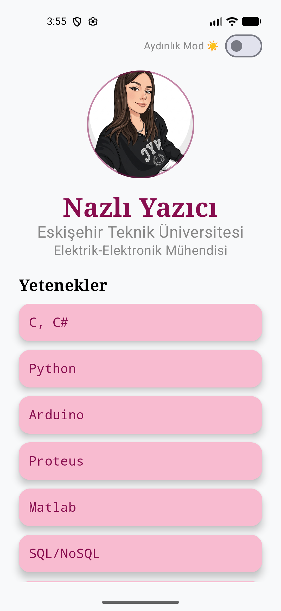

# Android Profil Ödevi

Bu proje, Turkcell Geleceği Yazan Kadınlar (GYGY) Android Geliştirme Eğitimi kapsamında hazırlanmış bir profil sayfası uygulamasıdır. Uygulama, Jetpack Compose kullanılarak geliştirilmiştir ve temel kişisel bilgileri ile yetkinlikleri modern bir arayüzle sunar.

## Proje Hakkında

Uygulama, Eskişehir Teknik Üniversitesi Elektrik-Elektronik Mühendisi öğrencisi Nazlı Yazıcı'nın profesyonel profilini tanıtmaktadır. Kullanıcı arayüzü, hem açık (Light) hem de koyu (Dark) mod desteği sunarak kullanıcı deneyimini artırır.

## Özellikler

- **Jetpack Compose Arayüzü:** Tamamen modern, deklaratif bir UI yapısı.
- **Dinamik Tema:** Cihazın ayarlarına göre otomatik olarak Açık veya Koyu moda geçiş.
- **Görsel Tasarım:** Kişisel profil fotoğrafı, soft pembe tonları ve düzenli bir yetkinlik listesi.
- **Hafızada Tutma:** Dark Mode durumu `remember { mutableStateOf(...) }` ile hafızada tutulur.

## Uygulama Ekran Görüntüsü

Hazırlayan: [Nazlı Yazıcı] - [2026]