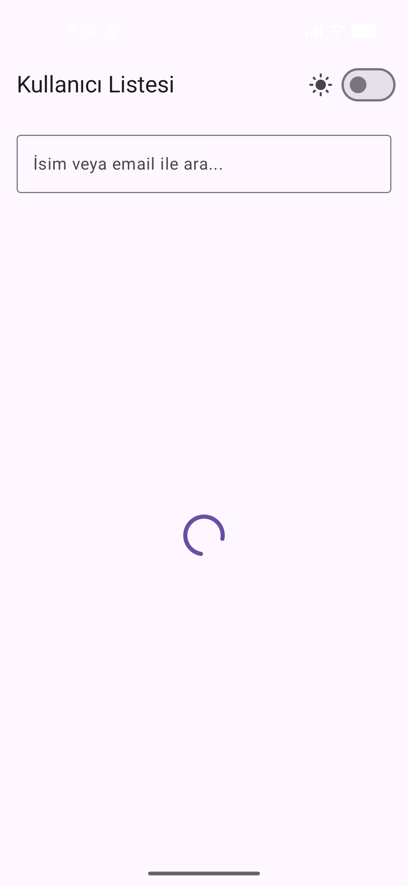
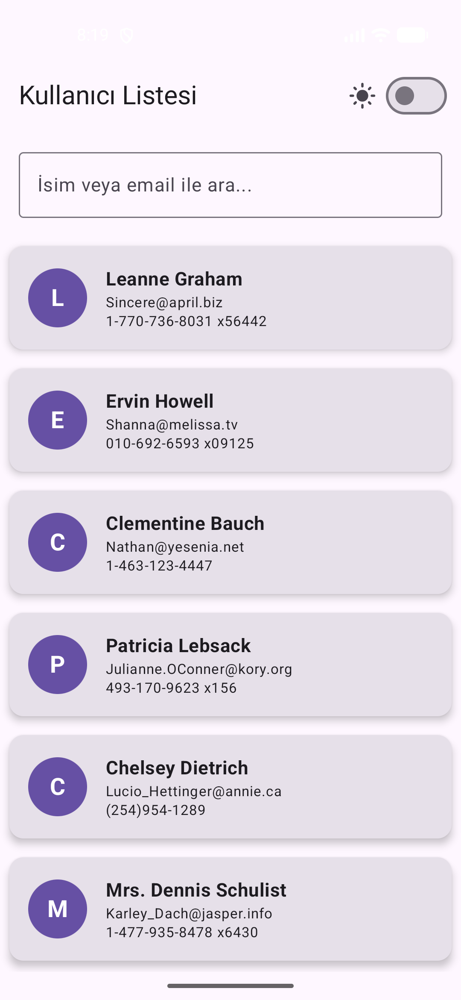
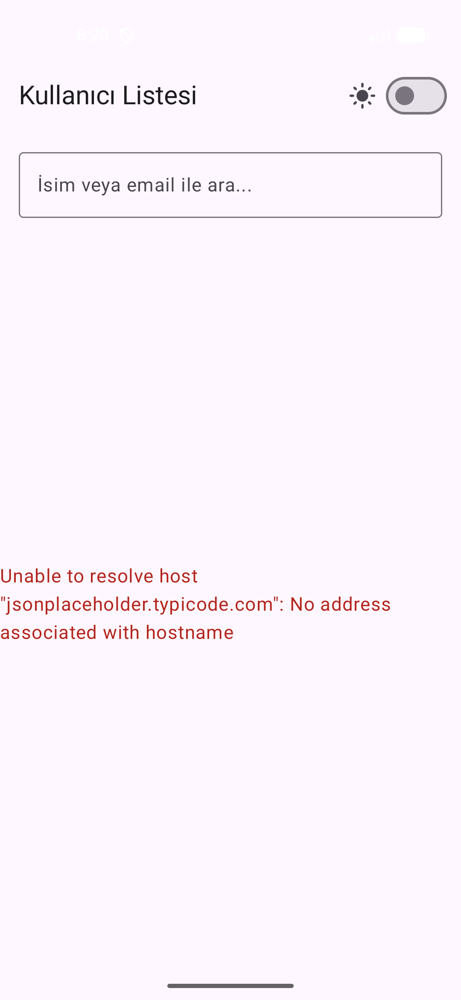

# 📱 Kullanıcı Listesi Uygulaması

Bu uygulama, bir REST API üzerinden kullanıcı verilerini asenkron olarak çeken, MVVM mimarisi ile yöneten ve Jetpack Compose ile listeleyen modern bir Android projesidir.

## 🚀 Kullanılan Teknolojiler

Uygulama geliştirilirken aşağıdaki modern kütüphaneler ve mimari yapılar tercih edilmiştir:

* **Kotlin**: Ana programlama dili.
* **Jetpack Compose**: Deklaratif ve modern UI tasarımı.
* **Retrofit & GSON**: API istekleri ve JSON verilerinin işlenmesi.
* **Coroutines**: API çağrılarının `suspend` fonksiyonlar ile arka planda yönetimi.
* **MVVM (Model-View-ViewModel)**: İş mantığı ve arayüzün birbirinden ayrıldığı temiz mimari.

## 📸 Ekran Görüntüleri

Uygulamanın durum yönetimi (State Management) testleri aşağıdadır:

|                    ⏳ (Loading)                    |                    ✅ (Success)                    |                    ❌ (Error)                    |
|:-------------------------------------------------:|:-------------------------------------------------:|:-----------------------------------------------:|
|  |  |  |


## 🛠️ Kurulum Adımları

Projeyi kendi ortamınızda çalıştırmak için:

1.  **Repoyu Klonlayın**:
    ```bash
    git clone [https://github.com/kullaniciadi/Kullanici_Listesi_Uygulamasi_HW.git](https://github.com/kullaniciadi/Kullanici_Listesi_Uygulamasi_HW.git)
    ```
2.  **Android Studio ile Açın**: "File > Open" diyerek proje klasörünü seçin.
3.  **Gradle Sync**: Projenin bağımlılıklarını indirmesi için senkronizasyonun bitmesini bekleyin.
4.  **Çalıştır**: Emülatör veya gerçek cihaz üzerinden projeyi başlatın.

## ✨ Ödev Kriterleri ve Özellikler

* **API Entegrasyonu**: `https://jsonplaceholder.typicode.com/users` endpoint'i kullanıldı.
* **Veri Modeli**: `id, name, username, email, phone, website` alanları başarıyla modellendi.
* **Bonus Özellikler**:
    * 🔍 **Arama Çubuğu**: İsim veya email'e göre dinamik filtreleme özelliği eklendi.
    * 🌓 **Dark Mode**: Uygulama içi tema desteği ve kullanıcı dostu arayüz tasarımı yapıldı.
    * 🏗️ **Temiz Mimari**: ViewModel ve UI State yönetimi ile MVVM standartlarına uygun geliştirildi.

---
**Geliştiren:** Nazlı Yazıcı