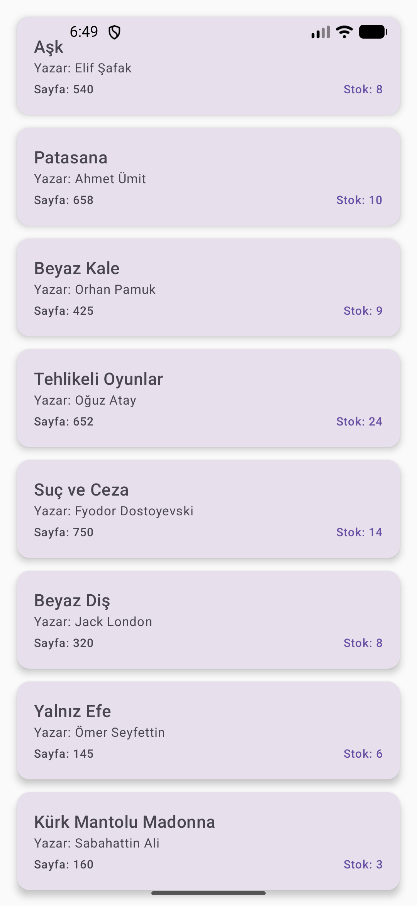

# Kütüphane Yönetim Sistemi - Mobil Uygulama Ödevi
## Bu Ödevde Neler Yapıldı?

Ödev kapsamında belirlenen üç ana madde uygulandı.

1.  **Kayıt Ol (Register) ve Navigasyon Yapısı:**
    * Kullanıcı başarılı bir şekilde kayıt olduktan sonra otomatik olarak Giriş (Login) ekranına yönlendiren `onRegisterSuccess` yapısı kuruldu.
    * `NavGraph` üzerinden ekranlar arası geçişler ve geri tuşu yönetimi (popUpTo) optimize edildi.

2.  **BookRepository Fonksiyonları:**
    * Veri yönetimi için `BookRepository` sınıfı içerisinde aşağıdaki fonksiyonlar tanımlandı:
        * **Güncelleme (Update):** Mevcut kitap bilgilerini Supabase üzerinde günceller.
        * **Silme (Delete):** Seçilen kitabı veri tabanından kaldırır.
        * **Arama (Search):** Kitap başlığına göre filtreleme yapar.

3.  **Modern Kart Tasarımı (BookItem UI):**
    * Ana ekrandaki (`HomeScreen`) düz metin listesi yerine, her bir kitap için özel bir `BookCard` tasarımı oluşturuldu.
    * Kart içeriğinde kitabın adı, yazarı, sayfa sayısı ve stok durumu sunuldu.

## 📸 Uygulama Ekran Görüntüsü

